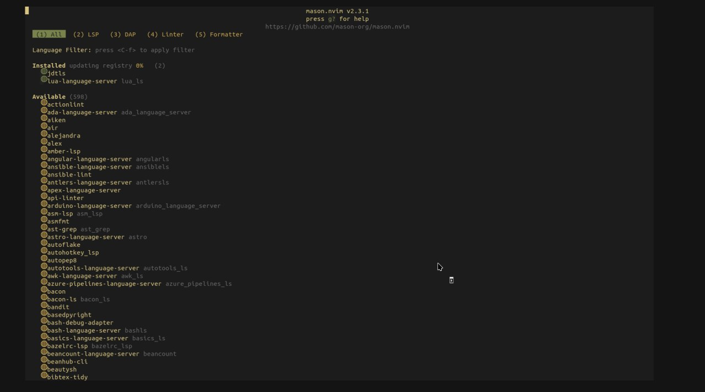

# 📦 Mexvim
> Minimalistic neovim configuration written in Lua.

> [!NOTE]
> **Work in Progress (WIP)**
> Project under building

---

## 🚀 Downloading methods

Clone repository to your nvim config folder
```
git clone https://github.com/Mexaas/Mexvim ~/.config/nvim
```

If you want to overwrite your old nvim to this config in one-line command
```
rm -rf ~/.config/nvim && git clone https://github.com/Mexaas/Mexvim ~/.config/nvim
```

## 🔍 Multiple configs
If you want to have many nvim configs, you can use `NVIM_APPNAME` method. Just clone config in `~/.config/nvim_folder_name` like in the example:
```
git clone https://github.com/Mexaas/Mexvim ~/.config/mexvim
```
Startup
```
NVIM_APPNAME=mexvim nvim
```

---
## ✨ Features

- Minimalistic status line via `lualine.lua`
- Simple configuration setup: all you need to do is select what you need
- File explorer with git & buffer integration via `neo-tree.nvim`
- Discord RPC: customizable presence via `cord.nvim`
- Syntax highlighting by `nvim-treesitter`
- LSP management via `mason.nvim`
- Dashboard customization via `snacks.nvim`
- Fast autocompletion with signature help via `blink.cmp`
- Easy colorscheme switching
- Maximum performance & keymaps customization

## 💻 Default hotkeys

<details>
<summary>Click there to open</summary>
🔗 By default, <LEADER> is a "SPACE". You can change it in `~/.config/your_nvim/lua/core/options.lua` by replacement `vim.g.mapleader = " "`

| Name | Key |
|:--------:|:------:|
|Window switch left|CTRL + H|
|Window switch down|CTRL + J|
|Window switch up|CTRL + K|
|Window switch right|CTRL + L|
|Window switch in Terminal|CTRL + H|
|Window switch down in Terminal|CTRL + J|
|Window switch up in Terminal|CTRL + K|
|Window switch right in Terminal|CTRL + L|
|Window resize left|CTRL + H|
|Window resize down|CTRL + J|
|Window resize up|CTRL + K|
|Window resize right|CTRL + L|
|Back to dashboard|LEADER + H|
|Open file explorer|LEADER + E|
|Save file|LEADER + W|
|Insert mode escape|J + K|
</details>


